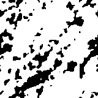

# PhaseRec.jl

Porous media reconstruction package which uses a method called "Phase
reconstruction" or, shortly, "PhaseRec".

Run `?phaserec` and `?autocorrelation` in REPL for documentation.

## Examples

| Original image             | Reconstructed image         | Commentary |
|----------------------------|-----------------------------|------------|
|  |  | Ceramic    |
|    |    | Shale      |
|     |     | Soil       |
